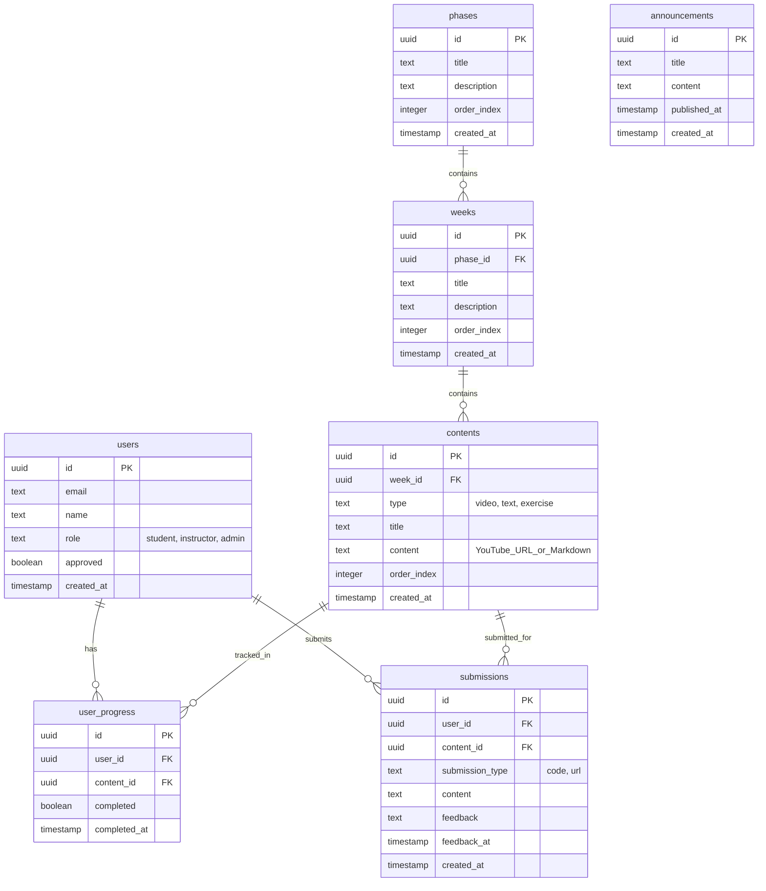

# データベース設計書

## 📊 ER図



## 📋 テーブル定義書

### users（ユーザー）

Supabase Authのユーザー拡張テーブル。

| カラム名 | 型 | NULL | デフォルト | 説明 |
|---------|-----|------|----------|------|
| id | uuid | NO | - | ユーザーID（Supabase Auth UUID） |
| email | text | NO | - | メールアドレス |
| name | text | NO | - | 氏名 |
| role | text | NO | 'student' | ロール（'student', 'instructor', 'admin'） |
| approved | boolean | NO | false | 承認状態（adminは常にtrue） |
| created_at | timestamp | NO | now() | 作成日時 |

**ロール説明**:
- `student`: 受講生（コンテンツ閲覧、課題提出）
- `instructor`: 講師・運営（受講生管理、課題フィードバック、コンテンツ管理）
- `admin`: システム管理者（全権限、ユーザー権限変更、システム設定）

**インデックス**:
- PRIMARY KEY (id)
- INDEX idx_users_email ON users(email)
- INDEX idx_users_approved ON users(approved)
- INDEX idx_users_role ON users(role)

**制約**:
- role IN ('student', 'instructor', 'admin')
- email UNIQUE

---

### phases（Phase）

学習フェーズ（例: Phase 1 - GAS基礎）

| カラム名 | 型 | NULL | デフォルト | 説明 |
|---------|-----|------|----------|------|
| id | uuid | NO | gen_random_uuid() | Phase ID |
| title | text | NO | - | Phaseタイトル |
| description | text | YES | - | Phase説明 |
| order_index | integer | NO | - | 表示順序 |
| created_at | timestamp | NO | now() | 作成日時 |

**インデックス**:
- PRIMARY KEY (id)
- INDEX idx_phases_order ON phases(order_index)

---

### weeks（Week）

学習週（例: Week 1 - はじめの一歩）

| カラム名 | 型 | NULL | デフォルト | 説明 |
|---------|-----|------|----------|------|
| id | uuid | NO | gen_random_uuid() | Week ID |
| phase_id | uuid | NO | - | 所属Phase ID |
| title | text | NO | - | Weekタイトル |
| description | text | YES | - | Week説明 |
| order_index | integer | NO | - | 表示順序 |
| created_at | timestamp | NO | now() | 作成日時 |

**インデックス**:
- PRIMARY KEY (id)
- FOREIGN KEY (phase_id) REFERENCES phases(id) ON DELETE CASCADE
- INDEX idx_weeks_phase ON weeks(phase_id)
- INDEX idx_weeks_order ON weeks(order_index)

---

### contents（コンテンツ）

学習コンテンツ（動画・テキスト・演習）

| カラム名 | 型 | NULL | デフォルト | 説明 |
|---------|-----|------|----------|------|
| id | uuid | NO | gen_random_uuid() | Content ID |
| week_id | uuid | NO | - | 所属Week ID |
| type | text | NO | - | コンテンツタイプ（'video', 'text', 'exercise'） |
| title | text | NO | - | コンテンツタイトル |
| content | text | NO | - | コンテンツ本体（YouTube URL or Markdown） |
| order_index | integer | NO | - | 表示順序 |
| created_at | timestamp | NO | now() | 作成日時 |

**インデックス**:
- PRIMARY KEY (id)
- FOREIGN KEY (week_id) REFERENCES weeks(id) ON DELETE CASCADE
- INDEX idx_contents_week ON contents(week_id)
- INDEX idx_contents_order ON contents(order_index)

**制約**:
- type IN ('video', 'text', 'exercise')

---

### user_progress（進捗管理）

ユーザーごとのコンテンツ完了状態

| カラム名 | 型 | NULL | デフォルト | 説明 |
|---------|-----|------|----------|------|
| id | uuid | NO | gen_random_uuid() | Progress ID |
| user_id | uuid | NO | - | ユーザーID |
| content_id | uuid | NO | - | コンテンツID |
| completed | boolean | NO | false | 完了フラグ |
| completed_at | timestamp | YES | - | 完了日時 |

**インデックス**:
- PRIMARY KEY (id)
- FOREIGN KEY (user_id) REFERENCES users(id) ON DELETE CASCADE
- FOREIGN KEY (content_id) REFERENCES contents(id) ON DELETE CASCADE
- UNIQUE (user_id, content_id)
- INDEX idx_user_progress_user ON user_progress(user_id)
- INDEX idx_user_progress_content ON user_progress(content_id)

---

### submissions（課題提出）

課題提出とフィードバック

| カラム名 | 型 | NULL | デフォルト | 説明 |
|---------|-----|------|----------|------|
| id | uuid | NO | gen_random_uuid() | Submission ID |
| user_id | uuid | NO | - | 提出者ID |
| content_id | uuid | NO | - | 課題コンテンツID |
| submission_type | text | NO | - | 提出タイプ（'code', 'url'） |
| content | text | NO | - | 提出内容（コードまたはURL） |
| feedback | text | YES | - | フィードバック |
| feedback_at | timestamp | YES | - | フィードバック日時 |
| created_at | timestamp | NO | now() | 提出日時 |

**インデックス**:
- PRIMARY KEY (id)
- FOREIGN KEY (user_id) REFERENCES users(id) ON DELETE CASCADE
- FOREIGN KEY (content_id) REFERENCES contents(id) ON DELETE CASCADE
- INDEX idx_submissions_user ON submissions(user_id)
- INDEX idx_submissions_content ON submissions(content_id)
- INDEX idx_submissions_feedback ON submissions(feedback_at) WHERE feedback_at IS NOT NULL

**制約**:
- submission_type IN ('code', 'url')

---

### announcements（お知らせ）

運営からのお知らせ

| カラム名 | 型 | NULL | デフォルト | 説明 |
|---------|-----|------|----------|------|
| id | uuid | NO | gen_random_uuid() | Announcement ID |
| title | text | NO | - | お知らせタイトル |
| content | text | NO | - | お知らせ本文（Markdown） |
| published_at | timestamp | NO | now() | 公開日時 |
| created_at | timestamp | NO | now() | 作成日時 |

**インデックス**:
- PRIMARY KEY (id)
- INDEX idx_announcements_published ON announcements(published_at DESC)

---

## 🔒 Row Level Security (RLS) ポリシー

### users

```sql
-- 受講生：自分のレコードのみ閲覧可能
CREATE POLICY "Users can view own profile"
  ON users FOR SELECT
  USING (auth.uid() = id);

-- 運営・管理者：全ユーザー閲覧可能
CREATE POLICY "Instructors and admins can view all users"
  ON users FOR SELECT
  USING (
    EXISTS (
      SELECT 1 FROM users
      WHERE id = auth.uid() AND role IN ('instructor', 'admin')
    )
  );

-- 運営：ユーザー承認・却下可能
CREATE POLICY "Instructors can approve users"
  ON users FOR UPDATE
  USING (
    EXISTS (
      SELECT 1 FROM users
      WHERE id = auth.uid() AND role IN ('instructor', 'admin')
    )
  )
  WITH CHECK (
    -- 運営はrole変更不可（adminのみ可能）
    CASE
      WHEN EXISTS (SELECT 1 FROM users WHERE id = auth.uid() AND role = 'admin')
      THEN true
      ELSE (SELECT role FROM users WHERE id = OLD.id) = NEW.role
    END
  );

-- 管理者：全ユーザー管理可能（role変更含む）
CREATE POLICY "Admins can manage all users"
  ON users FOR ALL
  USING (
    EXISTS (
      SELECT 1 FROM users
      WHERE id = auth.uid() AND role = 'admin'
    )
  );
```

### contents, phases, weeks

```sql
-- 承認済みユーザー：全コンテンツ閲覧可能
CREATE POLICY "Approved users can view contents"
  ON contents FOR SELECT
  USING (
    EXISTS (
      SELECT 1 FROM users
      WHERE id = auth.uid() AND approved = true
    )
  );

-- 運営・管理者：コンテンツ管理（CRUD）可能
CREATE POLICY "Instructors and admins can manage contents"
  ON contents FOR ALL
  USING (
    EXISTS (
      SELECT 1 FROM users
      WHERE id = auth.uid() AND role IN ('instructor', 'admin')
    )
  );
```

※ phases, weeks も同様のポリシーを適用

### user_progress

```sql
-- 受講生：自分の進捗のみ閲覧・更新可能
CREATE POLICY "Users can manage own progress"
  ON user_progress FOR ALL
  USING (user_id = auth.uid());

-- 運営・管理者：全進捗閲覧可能
CREATE POLICY "Instructors and admins can view all progress"
  ON user_progress FOR SELECT
  USING (
    EXISTS (
      SELECT 1 FROM users
      WHERE id = auth.uid() AND role IN ('instructor', 'admin')
    )
  );

-- 管理者：全進捗管理可能
CREATE POLICY "Admins can manage all progress"
  ON user_progress FOR ALL
  USING (
    EXISTS (
      SELECT 1 FROM users
      WHERE id = auth.uid() AND role = 'admin'
    )
  );
```

### submissions

```sql
-- 受講生：自分の提出のみ閲覧・作成可能
CREATE POLICY "Users can manage own submissions"
  ON submissions FOR SELECT
  USING (user_id = auth.uid());

CREATE POLICY "Users can create submissions"
  ON submissions FOR INSERT
  WITH CHECK (user_id = auth.uid());

-- 運営・管理者：全提出閲覧・フィードバック可能
CREATE POLICY "Instructors and admins can manage submissions"
  ON submissions FOR ALL
  USING (
    EXISTS (
      SELECT 1 FROM users
      WHERE id = auth.uid() AND role IN ('instructor', 'admin')
    )
  );
```

### announcements

```sql
-- 承認済みユーザー：お知らせ閲覧可能
CREATE POLICY "Approved users can view announcements"
  ON announcements FOR SELECT
  USING (
    EXISTS (
      SELECT 1 FROM users
      WHERE id = auth.uid() AND approved = true
    )
  );

-- 運営・管理者：お知らせ管理可能
CREATE POLICY "Instructors and admins can manage announcements"
  ON announcements FOR ALL
  USING (
    EXISTS (
      SELECT 1 FROM users
      WHERE id = auth.uid() AND role IN ('instructor', 'admin')
    )
  );
```

## 📈 パフォーマンス最適化

### インデックス戦略

1. **外部キー**: すべての外部キーにインデックス作成
2. **検索条件**: WHERE句で頻繁に使用するカラムにインデックス
3. **ソート**: ORDER BY句で使用するカラムにインデックス
4. **複合インデックス**: 複数カラムでの検索に対応

### クエリ最適化

- N+1問題回避: JOIN を活用
- 必要なカラムのみ SELECT
- COUNT() の最適化: 概算値で十分な場合は pg_stat で代替

## 🔄 マイグレーション戦略

### 初期セットアップ

1. テーブル作成（phases → weeks → contents の順）
2. RLSポリシー有効化
3. インデックス作成
4. シードデータ投入

### 将来的な拡張

- Phase 2（HTML/CSS/JS）、Phase 3（React）への対応
- テーブル追加時はマイグレーションファイルで管理
- ダウングレード可能な設計

---

**改訂履歴**

| 日付 | 内容 |
|------|------|
| 2024年12月 | 初版作成 |
